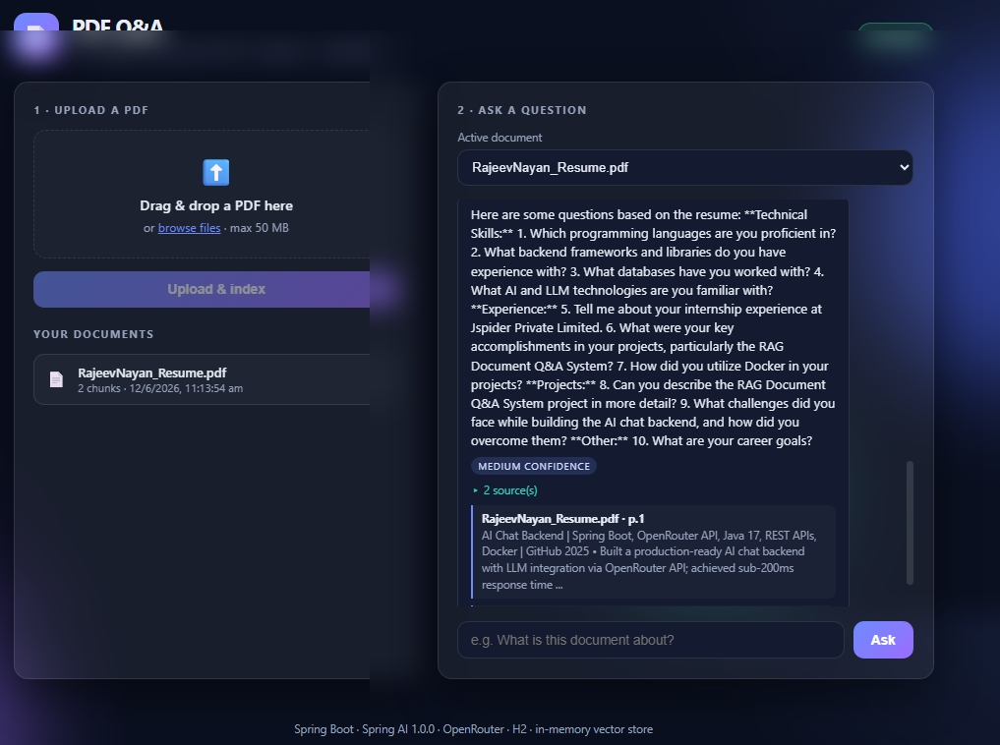

# 📄 PDF Q&A — Spring AI RAG (OpenRouter + H2)

Upload a PDF, ask questions about it, and get answers grounded in the document's content — with source citations. Built with **Spring Boot 3.5**, **Spring AI 1.0.0**, **OpenRouter** (OpenAI-compatible API) for chat + embeddings, **H2** for document metadata, and a lightweight **file-based in-memory vector store** (no Docker, no external vector DB).

---
## Demo


## ✨ Features

- **Upload & index PDFs** — pages are read, split into chunks, embedded, and stored.
- **Ask questions** — retrieval-augmented generation answers using only the selected document.
- **Source citations** — each answer shows the source file, page number, and snippet.
- **H2 database** — document metadata (id, filename, chunk count, timestamp) persisted in H2.
- **Beautiful, responsive UI** — drag-and-drop upload, document library, chat-style Q&A. Works on mobile and desktop.
- **No Docker required** — uses an in-memory `SimpleVectorStore` persisted to a JSON file.

---

## 🧱 Tech stack

| Layer | Technology |
|---|---|
| Runtime | Java 17+ (tested with JDK 21) |
| Framework | Spring Boot 3.5.0 |
| AI | Spring AI 1.0.0 (`spring-ai-starter-model-openai`) |
| LLM provider | OpenRouter (OpenAI-compatible) |
| PDF parsing | `spring-ai-pdf-document-reader` (`PagePdfDocumentReader`) |
| Vector store | `SimpleVectorStore` (in-memory, persisted to JSON) |
| Metadata DB | H2 (file-based) via Spring Data JPA |
| Frontend | Vanilla HTML/CSS/JS (no build step) |

---

## 📋 Prerequisites

- **JDK 17 or newer** (JDK 21 works fine)
- **Maven 3.9+** (or use the included `mvnw` wrapper)
- An **OpenRouter API key** → https://openrouter.ai/keys

> ℹ️ **Embeddings note:** OpenRouter primarily serves **chat** models. If your account/key cannot call an embeddings model, embedding (the upload/index step) will fail. In that case use a provider that supports `/v1/embeddings` for the embedding model (e.g. OpenAI) while keeping OpenRouter for chat. See [Troubleshooting](#-troubleshooting).

---

## 🚀 Getting started

### 1. Set your API key

**Windows (PowerShell):**
```powershell
$env:OPENROUTER_API_KEY="sk-or-..."
```

**macOS / Linux:**
```bash
export OPENROUTER_API_KEY="sk-or-..."
```

### 2. Run the app

**Windows (PowerShell):**
```powershell
mvn -U clean spring-boot:run
```

**macOS / Linux:**
```bash
./mvnw -U clean spring-boot:run
```

> On Windows, use `mvn` (or `mvnw.cmd`) — `./mvnw` is a Unix-style path and will not be recognized by PowerShell.

### 3. Open the UI

Visit **http://localhost:8080** → upload a PDF → select it → ask questions.

---

## 🖥️ Using the app

1. **Upload a PDF** in the left panel (drag-and-drop or browse). Indexing may take a few seconds depending on size.
2. The document appears in **Your documents** and is auto-selected in the **Active document** dropdown.
3. Type a question in the chat bar and press **Ask**.
4. Expand **sources** under any answer to see the cited snippets and page numbers.

---

## 🔌 REST API

### `GET /health`
Health check.
```json
{ "status": "ok" }
```

### `POST /api/ingest-pdf`  *(multipart/form-data)*
Upload and index a PDF. Form field: **`file`**.
```bash
curl -F "file=@mydoc.pdf" http://localhost:8080/api/ingest-pdf
```
Response:
```json
{ "documentId": "a1b2...", "filename": "mydoc.pdf", "chunkCount": 42, "status": "indexed" }
```

### `GET /api/documents`
List indexed documents.
```json
[ { "documentId": "a1b2...", "filename": "mydoc.pdf", "createdAt": "2026-06-11T11:40:00Z", "chunkCount": 42 } ]
```

### `POST /api/ask`  *(application/json)*
Ask a question about one document.
```bash
curl -X POST http://localhost:8080/api/ask \
  -H "Content-Type: application/json" \
  -d '{"documentId":"a1b2...","question":"What is this document about?"}'
```
Response:
```json
{
  "answer": "...",
  "citations": [ { "source": "mydoc.pdf", "page": 3, "snippet": "..." } ],
  "confidence": "medium",
  "usedChunksCount": 5
}
```

---

## 🗄️ H2 database

Document metadata is stored in a file-based H2 database at `./data/ragdb.mv.db`.

The **H2 web console** is enabled for inspection:

- URL: **http://localhost:8080/h2-console**
- JDBC URL: `jdbc:h2:file:./data/ragdb`
- User: `sa`  ·  Password: *(empty)*

Table `DOCUMENTS` columns: `document_id`, `filename`, `created_at`, `chunk_count`.

---

## ⚙️ Configuration (`src/main/resources/application.yml`)

| Key | Default | Description |
|---|---|---|
| `server.port` | `8080` | HTTP port |
| `spring.ai.openai.base-url` | `https://openrouter.ai/api` | OpenRouter endpoint |
| `spring.ai.openai.api-key` | `${OPENROUTER_API_KEY}` | Your API key (env var) |
| `spring.ai.openai.chat.options.model` | `deepseek/deepseek-chat-v3-0324:free` | FREE chat model (runs on OpenRouter, no credits) |
| `spring.ai.model.chat` | `openai` | Chat provider |
| `spring.ai.model.embedding` | `transformers` | Embeddings run LOCALLY (ONNX all-MiniLM-L6-v2) — no credits |
| `app.rag.top-k` | `5` | Chunks used to build the answer |
| `app.rag.max-snippet-chars` | `350` | Max snippet length in citations |
| `app.vectorstore.path` | `./data/vectorstore.json` | Vector store persistence file |
| `spring.servlet.multipart.max-file-size` | `50MB` | Max PDF upload size |

The default chat model is **free** (`deepseek/deepseek-chat-v3-0324:free`), so the whole app runs with **zero credits** (embeddings are local, chat uses a free OpenRouter model). Free models are rate-limited (~50 requests/day on the free tier) and availability can change — browse current free ids at https://openrouter.ai/models?q=free. If you have credits and want higher quality, swap in a paid id like `openai/gpt-4o-mini` or `anthropic/claude-3.5-sonnet`.

---

## 🗂️ Project structure

```
pdf-rag-prd/
├── pom.xml
├── README.md
└── src/main/
    ├── java/com/example/pdfrag/
    │   ├── PdfRagPrdApplication.java      # Spring Boot entry point
    │   ├── api/
    │   │   ├── HealthController.java       # GET /health
    │   │   ├── RagController.java          # /api/ingest-pdf, /api/documents, /api/ask
    │   │   └── GlobalExceptionHandler.java # JSON error responses
    │   ├── config/
    │   │   └── VectorStoreConfig.java      # SimpleVectorStore bean (+ load on startup)
    │   ├── ingest/
    │   │   └── PdfIngestionService.java    # read → split → embed → store
    │   ├── rag/
    │   │   └── RagService.java             # retrieve → prompt → answer + citations
    │   └── store/
    │       ├── DocumentEntity.java         # JPA entity (H2)
    │       ├── DocumentRepository.java     # Spring Data JPA repo
    │       └── DocumentRegistry.java       # metadata service
    └── resources/
        ├── application.yml
        └── static/                         # responsive UI
            ├── index.html
            ├── styles.css
            └── app.js
```

---

## 🧠 How it works

1. **Ingest** — `PagePdfDocumentReader` reads the PDF (one `Document` per page, with `page_number` metadata). `TokenTextSplitter` chunks the text. Each chunk is tagged with a `documentId` + `source`, embedded via OpenRouter, and added to the vector store (saved to JSON).
2. **Ask** — the question is embedded and used for similarity search. Because `SimpleVectorStore` doesn't support metadata filter expressions, the app retrieves a wider candidate set and filters by `documentId` in Java, then keeps the top-K.
3. **Answer** — retrieved chunks become the context for a grounded prompt sent to the chat model. The response is returned with citations (source, page, snippet) and a simple confidence flag.

---

## 🛟 Troubleshooting

**`'dependencies.dependency.version' ... is missing`**
You're using an old Spring AI artifact name. This project uses the correct **Spring AI 1.0.0** names:
`spring-ai-starter-model-openai` and `spring-ai-pdf-document-reader`. Run `mvn -U clean package` to refresh.

**`./mvnw is not recognized` (Windows PowerShell)**
Use `mvn` or `mvnw.cmd` instead of `./mvnw`.

**Embedding/index step fails (401 / model not found on embeddings)**
OpenRouter may not serve an embeddings endpoint for your key. Point embeddings at a provider that does (e.g. OpenAI) while keeping OpenRouter for chat — set a separate base-url/key for the embedding client, or switch `spring.ai.openai.*` to OpenAI for embeddings.

**Port 8080 in use**
Change `server.port` in `application.yml`.

**Reset everything**
Stop the app and delete the `./data/` folder (removes H2 db + vector store).

---

## 📌 Notes

- First request to a model may be slower (cold start / token setup).
- The vector store and H2 DB both live under `./data/` and persist across restarts.
- This is a starter/demo project — no authentication is included by design.
